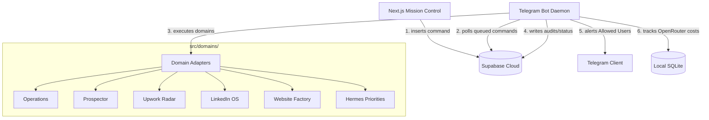

# EvansAISolutions Business Operator (Gravity Claw)

Gravity Claw is the modular, internal B2B Business Operator daemon and Mission Control dashboard orchestrating lead acquisition, template stamping, and client delivery pipelines for **EvansAISolutions**.

---

## EvansAISolutions Business Operator — Current Architecture



### Components Summary
1. **Frontend: Next.js Command Center** (`/mission-control`):
   * Provides real-time telemetry (business metrics, project list, active campaigns, agent activity logs).
   * Exposes a **Quick Actions** cockpit for triggering B2B workflows.
   * Renders a real-time **Command Audit Trail** tracing execution status, timestamps, and error summaries.

2. **Backend: Bot Daemon** (`src/index.ts` & `src/heartbeat.ts`):
   * Runs Grammy Telegram bot long-polling loops.
   * Hosts a background interval poller picking up queued `system_commands` from Supabase.
   * Restricts processing to authorized Telegram user IDs.
   * Runs startup safety and production checks to avoid cloud concurrency conflicts.

3. **Domain Adapters Layer** (`src/domains/*`):
   * Modularized interface points for LinkedIn OS, Prospector lead scoring, Upwork Radar matching, Website Factory template stamper, Hermes priorities loader, and Operations invoice/briefing generators.
   * Implements robust local fallback stubs if configuration directories or credentials are empty.

4. **Data Sync Layer**:
   * **Supabase Cloud**: Tracks real-time leads, campaigns, project records, audit logs, and `system_commands`.
   * **Local SQLite**: Logs usage data (`usage.db`) and short-term variables (`gravity-claw.db`).

---

## Quick Start

### 1. Requirements
* Node.js v20+
* SQLite3

### 2. Startup
1. Set up your `.env` variables (see [ENVIRONMENT_AUDIT.md](file:///c:/Users/CEvns/Desktop/Antigravity/Gravity%20Claw/ENVIRONMENT_AUDIT.md)).
2. Install dependencies:
   ```bash
   npm install
   ```
3. Run the bot:
   ```bash
   npm run dev
   ```
4. Start the dashboard:
   ```bash
   cd mission-control
   npm install
   npm run dev
   ```

Refer to [OPERATOR_RUNBOOK.md](file:///c:/Users/CEvns/Desktop/Antigravity/Gravity%20Claw/OPERATOR_RUNBOOK.md) for full maintenance, deployment, and testing instructions.
